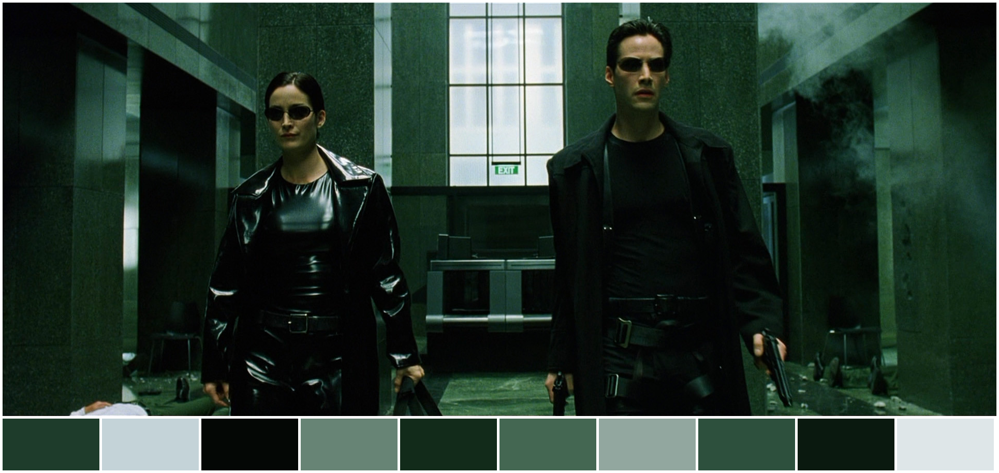
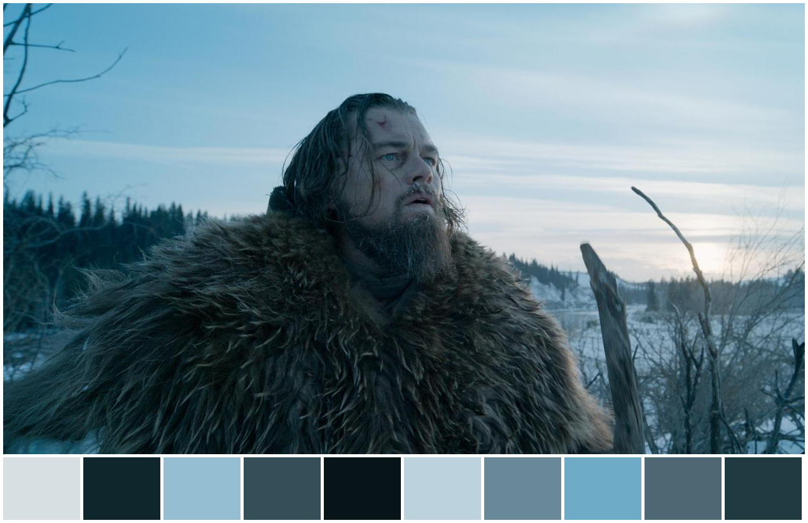
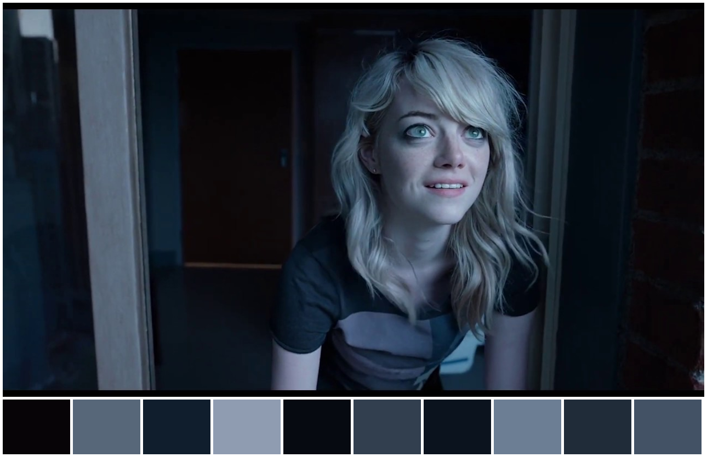

# Color Palette Generator
 
## Introduction

A neat application of K-means algorithm is generating color Palettes from images.<br/>
Kmeans algorithm is an iterative algorithm that tries to partition the dataset into Kpre-defined distinct non-overlapping subgroups (clusters) where each data point belongs to only one group.<br/>

The way kmeans algorithm works is as follows:
1. Specify number of clusters K.
2. Initialize centroids by first shuffling the dataset and then randomly selecting K data points for the centroids without replacement.
3. Keep iterating until there is no change to the centroids.

## Description
This project utilizes [`sklearn's K-means`](https://scikit-learn.org/stable/modules/generated/sklearn.cluster.KMeans.html) implementation of the algorithm.<br/>
In addition, we used [`PIL Image`](https://pillow.readthedocs.io/en/stable/reference/Image.html) to construct the final image with Color palettes at the bottom.<br/>

## Samples
<p align="center">
 
 <a href="https://www.imdb.com/title/tt0133093/">The Matrix</a>
 <br/><br/>
 

 <a href="https://www.imdb.com/title/tt3783958/?ref_=fn_al_tt_1">La La Land</a>
 <br/><br/>
 
 
 <a href="https://www.imdb.com/title/tt1663202/?ref_=nv_sr_srsg_0">The Revenant</a>
 <br/><br/>
 
 
 <a href="https://www.imdb.com/title/tt2562232/?ref_=nv_sr_srsg_0">Birdman or (The Unexpected Virtue of Ignorance)</a>
 <br/><br/>
 </p>
 
 ## Structure
 `Main.py` contains the source code for this project.<br/>
`results` all produced images from this project.<br/>
`imgs` all tested images in this project.<br/>

 ## To Run
 After installoing the required libraries, take note of the following two arguments:<br/>
 `-i` path of the image<br/>
 `-c` number of clusters<br/>
 ```
 python -u Main.py -i imgs/Matrix.png -c 10
 ```
